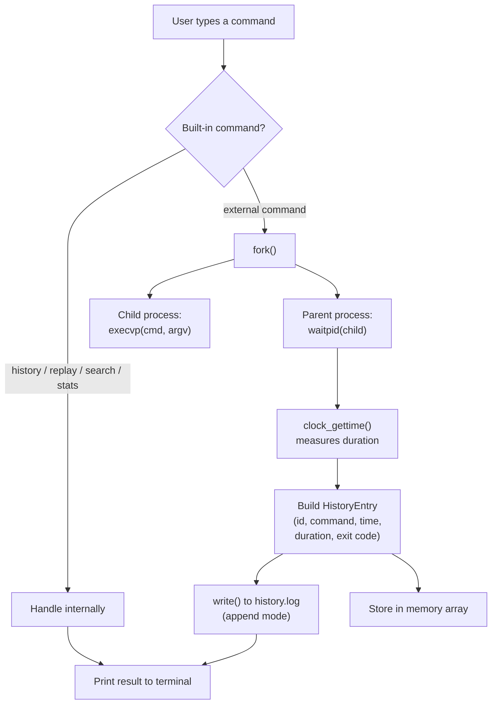
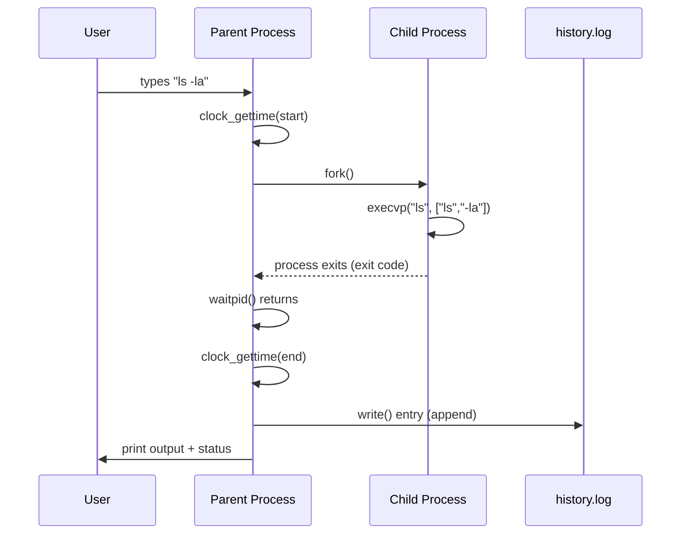

# 🕘 Command History & Replay Tool

**Mini Project — Operating Systems and System Calls** *A POSIX-based command wrapper with persistent history, search, and replay*

---

## 📑 Table of Contents

1. [Project at a Glance](#1-project-at-a-glance)
2. [Overview](#2-overview)
3. [Problem Statement](#3-problem-statement)
4. [Project Scope](#4-project-scope)
5. [Architecture](#5-architecture)
6. [System Calls Used](#6-system-calls-used)
7. [Features](#7-features)
8. [Log File Format](#8-log-file-format)
9. [Testing Plan](#9-testing-plan)
10. [Timeline](#10-timeline)
11. [Risks & Mitigations](#11-risks--mitigations)
12. [Deliverables](#12-deliverables)
13. [Build & Run Instructions](#13-build--run-instructions)
14. [Possible Extensions](#14-possible-extensions)

---

## 1. Project at a Glance

|  |  |
| --- | --- |
| **Language** | C (POSIX / `unistd.h`, `sys/wait.h`) |
| **Platform** | Linux / any POSIX-compliant OS |
| **Core pattern** | `fork()` → `execvp()` → `waitpid()` |
| **Persistence** | Plain-text log file (`history.log`) |
| **Interface** | Interactive terminal REPL |
| **Difficulty** | Easy → Moderate |

> **One-line pitch:** *A lightweight shell companion that remembers every command you ran, how long it took, whether it succeeded — and lets you run it again with one word.*

---

## 2. Overview

**Command History & Replay Tool** is a command-line program that acts as a *wrapper* around command execution. The user types a command into the program, and the program:

1. Actually runs the command using POSIX system calls (`fork`, `execvp`, `wait`)
2. Logs metadata for each run — command text, timestamp, duration, exit code — to a log file
3. Lets the user view history, search, view statistics, and **replay** (re-run) past commands

Think of it as building your own `history` as a standalone tool, with richer bookkeeping than a normal shell offers out of the box.

---

## 3. Problem Statement

Standard shells (bash, zsh) already ship a built-in `history`, but it falls short in a few ways:

| Limitation of shell `history` | What this tool adds |
| --- | --- |
| No exit code recorded | ✅ Every entry stores exit code |
| No execution time recorded | ✅ Millisecond-precision duration via `clock_gettime` |
| Hard to filter failed commands | ✅ `search` / future exit-code filter |
| No usage statistics | ✅ `stats` — most-used & slowest commands |

This project builds a tool that records richer **metadata** about each command run — useful for debugging, auditing, or simply understanding your own workflow.

---

## 4. Project Scope

### ✅ In scope (MVP)

- Run external commands via `fork` + `execvp` + `wait`
- Log to a file that **persists across program restarts**
- Built-in commands: `history`, `replay <id>`, `search <keyword>`, `stats`, `exit`

### 🚫 Out of scope *(intentionally, to keep scope realistic)*

- Pipes (`|`) and I/O redirection (`>`, `<`) between commands
- Background jobs (`&`)
- Shell scripting / variable expansion

> Keeping these out of scope is itself a design decision worth stating explicitly in the report — it shows deliberate scoping rather than an oversight.

---

## 5. Architecture



**Key idea:** the parent process never runs the command itself — it delegates to a child process, then `wait`s and collects the result. This is the exact same pattern every real shell uses whenever it launches an external program.

### Process lifecycle for one command



---

## 6. System Calls Used

| System call | Header | Role in this project |
| --- | --- | --- |
| `fork()` | `<unistd.h>` | Creates a child process to run each command the user types |
| `execvp()` | `<unistd.h>` | Replaces the child process image with the requested program (e.g. `ls`, `cat`) |
| `waitpid()` | `<sys/wait.h>` | Parent waits for the child to finish and retrieves its exit status |
| `clock_gettime(CLOCK_MONOTONIC, …)` | `<time.h>` | Measures start/end time of a command precisely, for duration tracking |
| `open()` / `write()` / `read()` / `close()` | `<fcntl.h>` / `<unistd.h>` | Low-level file I/O for `history.log`, instead of `fopen`/`fprintf` |

---

## 7. Features

### MVP (required)

- [ ] Correctly runs external commands and shows their normal output
- [ ] Records: id, command, timestamp, exit code, duration
- [ ] `history` — shows full history
- [ ] `replay <id>` — re-runs a past command by id
- [ ] Persists the log to a file, so history survives across program restarts

### Extended (stretch goals, if time allows)

- [ ] `search <keyword>` — filters commands by keyword
- [ ] `stats` — most-used command, longest-running command
- [ ] Session separation (tag which session each command belongs to)
- [ ] Filter by exit code (e.g. show only failed commands)

---

## 8. Log File Format

Plain text, one command per line, fields separated by `|`:

```
id|timestamp|duration_ms|exit_code|command
1|1727764212|45|0|ls -la
2|1727764225|1200|1|cat nofile.txt
3|1727764240|12|0|echo hello
```

| Field | Type | Example | Notes |
| --- | --- | --- | --- |
| `id` | int | `1` | Sequential, used by `replay` |
| `timestamp` | unix epoch | `1727764212` | From `time(NULL)` |
| `duration_ms` | double | `45` | From `clock_gettime` delta |
| `exit_code` | int | `0` | From `WEXITSTATUS(status)` |
| `command` | string | `ls -la` | Raw command line, unparsed |

Plain text was chosen deliberately: easy to read, easy to debug with `cat`/`grep`, and can be written/read directly with `open`/`read`/`write` — no need for a serialization library.

---

## 9. Testing Plan

| Test case | Expected result |
| --- | --- |
| Run a valid command (`echo hello`) | Output shown, exit code `0` logged |
| Run an invalid command (`foobar123`) | `"command not found"` printed, exit code `127` logged |
| `replay` with a valid id | Command re-executes identically |
| `replay` with an out-of-range id | Graceful error message, no crash |
| Restart the program | Previous history still visible (loaded from log) |
| `search` with no matches | `"no matches found"` message, no crash |
| Empty input (just Enter) | Prompt re-displays, nothing logged |

---

## 10. Timeline

| Week | Milestone |
| --- | --- |
| 1 | Finalize scope, set up repo, implement basic `fork`/`execvp`/`wait` loop |
| 2 | Add logging (`open`/`write`) and history loading on startup |
| 3 | Implement `history`, `replay`, `search`, `stats` |
| 4 | Testing, edge cases, polish, write documentation |
| 15 | Demo presentation |

*(Adjust week numbers to match your actual course schedule.)*

---

## 11. Risks & Mitigations

| Risk | Mitigation |
| --- | --- |
| Parsing commands with quoted arguments (`echo "hello world"`) is tricky | Start with simple whitespace-split parsing; document as a known limitation |
| Log file grows unbounded over time | Cap history size (e.g. `MAX_HISTORY`), or rotate the log file |
| `execvp` failure leaves a zombie/orphan if not handled | Always pair `fork()` with `waitpid()`; use `_exit()` not `exit()` in the child on error |
| Command not found crashes the whole tool | Check `execvp` return value; child calls `_exit(127)` on failure instead of falling through |

---

## 12. Deliverables (per assignment requirements)

| Deliverable | What it covers in this project |
| --- | --- |
| **Source code + documentation** | `.c` file with comments explaining each function, plus a README on how to build/run |
| **Demo presentation** | Live demo: run commands, view history, replay, search, view stats |
| **Final report** | Architecture diagrams (above), system calls table, feature checklist, test results |

---

## 13. Build & Run Instructions

```bash
gcc -O2 -Wall command_history_tool.c -o history_tool
./history_tool
```

Example session:

```
> ls -la
> echo hello world
> history
> replay 1
> search echo
> stats
> exit
```

---

## 14. Possible Extensions

> Ideas worth mentioning in the report's "Future Work" section, even if not implemented:

- 🔁 Replay a **range** of commands (`replay 3-7`)
- 🏷️ Tag commands manually (`#deploy`, `#debug`) for easier filtering
- 📊 Export stats as CSV for further analysis
- 🧵 Separate log files per terminal session (using `getpid()` or session id)
- ⏱️ Warn when a command's duration is far above its historical average