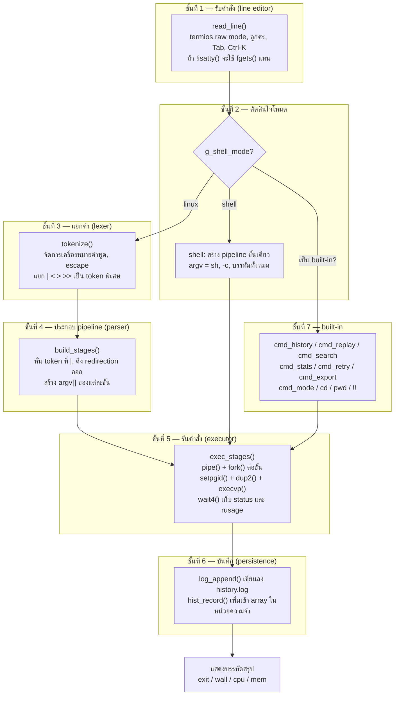
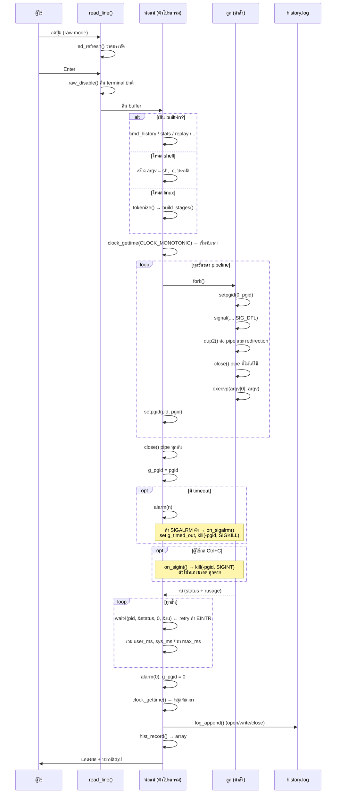

# สถาปัตยกรรมของ Command History & Replay Tool

เอกสารฉบับนี้อธิบาย **สถาปัตยกรรม**, **รายละเอียดการทำงานแต่ละชั้น**, **system calls ทั้งหมดที่ใช้**
และ **ฟีเจอร์** ของโปรแกรม

> ไฟล์เดียว: `proj/command_history_tool.c` (1799 บรรทัด) — ภาษา C, POSIX, ไม่มีไลบรารีภายนอก

---

## สารบัญ

1. [ภาพรวมสถาปัตยกรรม](#1-ภาพรวมสถาปัตยกรรม)
2. [โครงสร้างข้อมูล](#2-โครงสร้างข้อมูล)
3. [สถาปัตยกรรมโดยละเอียด — แยกเป็นชั้น](#3-สถาปัตยกรรมโดยละเอียด--แยกเป็นชั้น)
4. [วงจรชีวิตของ 1 คำสั่ง](#4-วงจรชีวิตของ-1-คำสั่ง)
5. [ตาราง System Calls ทั้งหมด](#5-ตาราง-system-calls-ทั้งหมด)
6. [System Calls ที่ไม่ได้ใช้ และเหตุผล](#6-system-calls-ที่ไม่ได้ใช้-และเหตุผล)
7. [ฟีเจอร์ทั้งหมด](#7-ฟีเจอร์ทั้งหมด)
8. [การตัดสินใจเชิงออกแบบ](#8-การตัดสินใจเชิงออกแบบ)
9. [บั๊กที่พบระหว่างทดสอบและวิธีแก้](#9-บั๊กที่พบระหว่างทดสอบและวิธีแก้)
10. [ค่าคงที่และการปรับแต่ง](#10-ค่าคงที่และการปรับแต่ง)

---

## 1. ภาพรวมสถาปัตยกรรม

โปรแกรมแบ่งเป็น **7 ชั้น** ข้อมูลไหลจากบนลงล่างทางเดียว



**จุดสำคัญที่สุดของสถาปัตยกรรมนี้:** โหมด `shell` ถูกทำให้เป็น **pipeline ขั้นเดียว**
ที่ argv เป็น `sh -c <บรรทัด>` แล้วส่งเข้า `exec_stages()` เหมือนโหมด `linux` ทุกประการ

ผลคือ **ชั้นที่ 5, 6, 7 เป็นโค้ดชุดเดียวที่ใช้ร่วมกันทั้งสองโหมด** —
การจับเวลา, การเก็บ `rusage`, การส่งสัญญาณ, timeout และการบันทึก log เหมือนกันเป๊ะ
ต่างกันแค่ argv ที่ถูกสร้างในชั้นที่ 2–4 เท่านั้น
ทำให้สองโหมดไม่มีวันพฤติกรรมต่างกันโดยไม่ได้ตั้งใจ

---

## 2. โครงสร้างข้อมูล

### `Token` — คำศัพท์ 1 คำจาก lexer

```c
typedef struct {
    char *text;      /* ข้อความของ token */
    int   is_op;     /* 1 = เป็น shell operator (| < > >>) */
} Token;
```

`is_op` สำคัญมาก: ตัวอักษร `|` ที่อยู่ **ในเครื่องหมายคำพูด** จะมี `is_op = 0`
จึงไม่มีวันถูกเข้าใจผิดว่าเป็นตัวคั่น pipeline

### `Stage` — pipeline 1 ขั้น พร้อม redirection

```c
typedef struct {
    char **argv;     /* อาร์กิวเมนต์สำหรับ execvp() */
    int    argc;
    char  *infile;   /* จาก '<'   */
    char  *outfile;  /* จาก '>' หรือ '>>' */
    int    append;   /* 1 ถ้า operator เป็น '>>' */
} Stage;
```

### `HistoryEntry` — 1 บรรทัดของ history.log

```c
typedef struct {
    int     id;
    time_t  timestamp;
    double  wall_ms;
    int     exit_code;
    double  user_ms;
    double  sys_ms;
    long    max_rss_kb;
    char   *command;
} HistoryEntry;
```

ตรงกับเอกสาร proposal ข้อ 9 ทุกฟิลด์

### `RunMetrics` — ผลการวัดจากการรัน 1 ครั้ง

```c
typedef struct {
    int    exit_code;
    double wall_ms;
    double user_ms;
    double sys_ms;
    long   max_rss_kb;
    int    timed_out;
} RunMetrics;
```

### ตัวแปร global

| ตัวแปร | ชนิด | หน้าที่ |
|---|---|---|
| `g_hist`, `g_count`, `g_cap` | `HistoryEntry *`, `int` | array ประวัติที่โตได้ด้วย `realloc()` |
| `g_timed_out` | `volatile sig_atomic_t` | flag บอกว่า timeout เกิดขึ้น — ชนิดนี้เท่านั้นที่การันตีว่าปลอดภัยเมื่อใช้ข้าม signal |
| `g_pgid` | `volatile pid_t` | process group ของคำสั่งที่กำลังรัน (0 = ไม่มี) |
| `g_shell_mode` | `int` | 0 = linux, 1 = shell |
| `g_orig_tio`, `g_raw` | `struct termios`, `int` | เก็บค่า terminal เดิมไว้คืนตอนปิด raw mode |
| `g_log_path` | `char[PATH_MAX + 32]` | absolute path ของ history.log |

---

## 3. สถาปัตยกรรมโดยละเอียด — แยกเป็นชั้น

### ชั้นที่ 1 — รับคำสั่ง: line editor

เขียนเองด้วย `termios` **ไม่ใช้ GNU readline** (เหตุผลดูข้อ 8)

| ฟังก์ชัน | หน้าที่ |
|---|---|
| `raw_enable()` | `tcgetattr()` เก็บค่าเดิม แล้ว `tcsetattr()` ปิด `ICANON`, `ECHO`, `ISIG`, `IXON`, `ICRNL` |
| `raw_disable()` | คืนค่า terminal เดิม |
| `ed_refresh()` | วาดบรรทัดใหม่: `\r` + prompt + buffer + `\x1b[K` (ลบถึงท้ายบรรทัด) + `\x1b[nD` (ถอยเคอร์เซอร์กลับ) |
| `read_byte_timeout()` | อ่าน 1 byte โดยมี timeout ผ่าน `select()` — กัน `EINTR` ด้วย |
| `read_line()` | loop หลัก รับ byte ทีละตัว ตีความทุกปุ่ม |

**ความหมายของ flag ที่ปิด:**

| flag | ปิดแล้วได้อะไร |
|---|---|
| `ICANON` | terminal ส่ง byte มาทันที ไม่ต้องรอ Enter — โปรแกรมจึงแก้ไขบรรทัดเองได้ |
| `ECHO` | terminal ไม่ echo ตัวอักษร — โปรแกรมวาดเองผ่าน `ed_refresh()` |
| `ISIG` | Ctrl+C ไม่กลายเป็น SIGINT อัตโนมัติ — โปรแกรมตีความเป็น "ยกเลิกบรรทัด" เอง |
| `IXON` | Ctrl-S / Ctrl-Q ไม่หยุดหน้าจอ |
| `ICRNL` | Enter ไม่ถูกแปลงเป็น `\n` อัตโนมัติ — โปรแกรมจัดการ `\r` เอง |

**raw mode ถูกปิดก่อนรันคำสั่งเสมอ** (`read_line()` เรียก `raw_disable()` ก่อน return)
ลูกจึงได้ terminal แบบ canonical ปกติ

**การแยก Escape เดี่ยว ออกจากลูกศร:**
ลูกศรส่งมาเป็น 3 byte คือ `ESC [ A` แต่การกด Escape เฉย ๆ ก็ส่ง `ESC` เหมือนกัน
โปรแกรมจึงอ่าน byte แรกแบบ blocking แล้วอ่าน byte ถัดไปด้วย `select()` timeout 50ms —
ถ้าไม่มี byte ตามมาภายใน 50ms ถือว่าเป็น Escape เดี่ยว

**fallback เมื่อไม่ใช่ terminal:**
`read_line()` ตรวจ `isatty(STDIN_FILENO)` ก่อน — ถ้าไม่ใช่ terminal (เช่นถูก pipe)
จะใช้ `fgets()` ธรรมดา นี่คือสิ่งที่ทำให้ `make test` และการ pipe คำสั่งเข้าโปรแกรมทำงานได้

### Tab completion

| ฟังก์ชัน | หน้าที่ |
|---|---|
| `is_cmd_char()` | กำหนดว่าอักษรตัวไหนถือเป็นส่วนหนึ่งของ "คำ" |
| `complete_commands()` | สแกนทุกไดเรกทอรีใน `PATH` ด้วย `opendir`/`readdir` แล้วตรวจ `access(X_OK)` |
| `complete_files()` | อ่านชื่อไฟล์ในไดเรกทอรีปัจจุบัน (หรือตาม path ที่พิมพ์) |
| `match_add()` | เพิ่มผลลัพธ์ พร้อมกันรายการซ้ำ (ชื่อเดียวกันเจอสองครั้งใน `PATH`) |
| `common_prefix()` | หาส่วนprefix ที่ทุกตัวเลือกมีร่วมกัน |
| `ed_complete()` | ตัดสินใจว่าจะเติมอะไร: prefix ร่วม / ตัวเลือกเดียว / แสดงรายการทั้งหมด |

**ตรรกะของ `ed_complete()`:**

```
หาขอบเขตคำปัจจุบัน (ย้อนจากเคอร์เซอร์)
├─ คำแรก (ข้างหน้ามีแต่ whitespace)?
│   └─ complete_commands()  ← สแกน PATH
└─ คำอื่น?
    └─ complete_files()     ← อ่านไดเรกทอรี

n == 0            → บี๊บ (\a) ไม่เติมอะไร
common prefix > ที่พิมพ์ไว้ → เติมส่วนที่ต่าง (memmove แล้ว memcpy)
n == 1            → เติมให้เต็ม + stat() ตรวจว่าเป็นไดเรกทอรีหรือไม่ ถ้าใช่เติม '/'
n > 1 และเติมไม่ได้แล้ว → แสดงรายการ (จำกัด LIST_MAX = 64 รายการ)
```

### ชั้นที่ 2–4 — แยกคำและประกอบ pipeline (เฉพาะโหมด linux)

| ฟังก์ชัน | หน้าที่ |
|---|---|
| `tok_push()` | เพิ่ม token เข้า array |
| `tokenize()` | lexer: แยกบรรทัดเป็น token |
| `build_stages()` | parser: หั่น token ที่ `|`, ดึง redirection ออก, สร้าง `argv[]` |
| `tokens_free()`, `stages_free()` | คืนหน่วยความจำ |

**`tokenize()` จัดการอะไรได้บ้าง:**

| กรณี | ผลลัพธ์ |
|---|---|
| `'single quotes'` | ข้อความตรง ๆ ไม่ตีความ escape ใด ๆ |
| `"double quotes"` | ตีความ `\"`, `\\`, `\$`, `` \` `` |
| `\` นอกเครื่องหมายคำพูด | escape อักษรถัดไป เช่น `hello\ world` เป็นคำเดียว |
| `echo hi>out.txt` | แยกเป็น `echo`, `hi`, `>`, `out.txt` — **ไม่ต้องเว้นวรรคก็แยกถูก** |
| เครื่องหมายคำพูดไม่ปิด | return `-1` แล้วรายงานว่า `parse: unbalanced quote` |

**`build_stages()` ทำงานอย่างไร:**
1. เดินผ่าน token หาตัวที่มี `is_op == 1` และ text เป็น `|` → ตัดเป็น stage ใหม่
2. ในแต่ละ stage หา `<`, `>`, `>>` → ดึง token ถัดไปเป็นชื่อไฟล์ เก็บไว้ใน `infile`/`outfile`
3. `argv[]` ที่เหลือคืออาร์กิวเมนต์ของโปรแกรม
4. **คัดลอกข้อความทั้งหมด (deep copy)** — เพราะ `tokens_free()` จะเป็นเจ้าของ token ต้นฉบับและคืนหน่วยความจำ

### ชั้นที่ 5 — รันคำสั่ง: executor

หัวใจของโปรแกรม อยู่ที่ `exec_stages()`

```
เตรียม: สร้าง pipe (nst-1 อัน), จด pgid = 0, npipes, nstarted

loop i = 0 .. nst-1:
  ├─ fork()
  ├─ ลูก:
  │    ├─ setpgid(0, pgid)              ← ปิดช่องโหว่ race กับฝั่งพ่อแม่
  │    ├─ signal(SIGINT/SIGALRM/SIGQUIT/SIGTERM, SIG_DFL)
  │    ├─ dup2(pipe[i-1][0], STDIN)     ← ถ้าไม่ใช่ขั้นแรก
  │    ├─ dup2(pipe[i][1],   STDOUT)    ← ถ้าไม่ใช่ขั้นสุดท้าย
  │    ├─ open(infile)  + dup2 → STDIN  ← ทำทีหลัง pipe จึง override ได้
  │    ├─ open(outfile) + dup2 → STDOUT
  │    ├─ close() pipe ทุกอัน (ทั้ง npipes อัน × 2 ฝั่ง)
  │    ├─ execvp(argv[0], argv)
  │    └─ _exit(EXIT_NOTFOUND)          ← ถ้า execvp ล้มเหลว
  └─ พ่อแม่:
       ├─ i == 0 ? pgid = pid[0]
       └─ setpgid(pid[i], pgid)          ← เรียกซ้ำเพื่อปิด race

พ่อแม่:
  ├─ close() pipe ทุกอัน  ← สำคัญมาก ถ้าไม่ปิด reader จะไม่เห็น EOF และค้างตลอดไป
  ├─ g_pgid = pgid
  ├─ ถ้ามี timeout → alarm(timeout_sec)
  ├─ loop wait4(pid[i], ..., &ru)  ← ถ้า EINTR ให้ลองใหม่
  │    ├─ user_ms += ru.ru_utime
  │    ├─ sys_ms  += ru.ru_stime
  │    └─ max_rss  = max(max_rss, ru.ru_maxrss)
  ├─ alarm(0)                            ← ยกเลิก timer
  ├─ g_pgid = 0                          ← สำคัญ: ดูข้อ 8
  └─ exit_code = status ของขั้นสุดท้าย
```

**ฟังก์ชันช่วย:**

| ฟังก์ชัน | หน้าที่ |
|---|---|
| `tv_ms()` | แปลง `struct timeval` เป็นมิลลิวินาที (double) |
| `status_to_exit()` | แปลง status จาก `wait4()` เป็น exit code — แยก `WIFEXITED`, `WIFSIGNALED` (ให้ `128 + signal`), timeout (ให้ `124`), exec ไม่ได้ (ให้ `126`) |
| `run_and_log()` | ตัวประสานงาน: เลือกโหมด → เรียก `exec_stages()` → แสดงผล → บันทึก log |

**ทำไม `npipes` และ `nstarted` ต้องจดไว้ก่อนเข้า loop:**
ถ้า `fork()` ล้มเหลวกลางทาง แล้วไปแก้ `nst` ให้เล็กลง loop ที่ใช้ปิด pipe (`for i < nst-1`)
จะปิดไม่ครบ — ทำให้ file descriptor รั่ว ต้องจดจำนวนจริงไว้ก่อน

### ชั้นที่ 6 — บันทึก

| ฟังก์ชัน | หน้าที่ |
|---|---|
| `log_path_init()` | แปลง `history.log` เป็น absolute path **ครั้งเดียวตอนเริ่มโปรแกรม** |
| `log_append()` | `open(O_WRONLY\|O_CREAT\|O_APPEND)` → `write()` → `close()` |
| `log_parse_line()` | แยก `|` 7 ตัวแรก ส่วนที่เหลือทั้งหมดคือคำสั่ง |
| `log_load()` | อ่านไฟล์เดิมตอนเปิดโปรแกรม สร้าง array และตั้ง `id` ต่อ |
| `hist_record()` | เพิ่ม entry ใหม่ เข้า array และเขียนลงไฟล์ |
| `hist_init()`, `hist_grow()`, `hist_free()` | จัดการ array ที่โตได้ (เริ่มที่ 64, เพิ่มเป็นสองเท่า) |

**ลำดับใน `hist_record()` สำคัญมาก:**

```c
char *copy = xstrdup(cmd);      /* คัดลอกก่อน */
if (g_count >= g_cap) hist_grow();   /* แล้วค่อย realloc */
```

ถ้าสลับบรรทัดกัน `hist_grow()` จะ `realloc()` ซึ่งอาจย้ายที่อยู่ของ array ทั้งก้อน —
ขณะที่ `cmd` ที่ caller ส่งมา (เช่น `cmd_replay` ส่ง `g_hist[idx].command`) ชี้เข้า array เดิม
จะกลายเป็น use-after-free ทันที

### ชั้นที่ 7 — สัญญาณและ built-in

| ฟังก์ชัน | หน้าที่ |
|---|---|
| `signals_setup()` | ติดตั้ง `sigaction()` สำหรับ `SIGINT` และ `SIGALRM` (มี `SA_RESTART`) |
| `on_sigint()` | `kill(-g_pgid, SIGINT)` — ส่งต่อไปยัง process group ของคำสั่ง |
| `on_sigalrm()` | ตั้ง `g_timed_out = 1` แล้ว `kill(-g_pgid, SIGKILL)` |
| `builtin_arg()` | จับคู่ชื่อ built-in ที่ต้นบรรทัด โดยบังคับ word boundary |
| `cmd_history()` | แสดงประวัติ รองรับ `--failed` และ `--slow` |
| `find_previous_same()` | หาการรันครั้งก่อนของคำสั่งเดียวกัน (ใช้โดย `replay`) |
| `cmd_replay()` | รันซ้ำ + แสดงผลต่าง |
| `cmd_search()` | ค้นหาด้วยคำค้น |
| `base_cmd()` | ตัดเอาเฉพาะคำแรกของคำสั่ง (ใช้จัดกลุ่มสถิติและหา flaky) |
| `cmd_stats()` | คำนวณสถิติและตรวจจับ flaky |
| `cmd_retry()` | รันซ้ำจนสำเร็จหรือครบจำนวนครั้ง |
| `csv_field()` | ครอบเครื่องหมายคำพูดและ escape `"` เป็น `""` ตามมาตรฐาน CSV |
| `cmd_export()` | เขียน CSV |
| `cmd_mode()` | ดู/สลับโหมด |
| `build_prompt()` | สร้าง prompt `[linux] ~/path> ` หรือ `[shell] ~/path> ` |

**signal handler ต้อง async-signal-safe:**
ใน handler ทำได้แค่ set flag (`volatile sig_atomic_t`) และเรียก `kill()`
**ห้ามเรียก `printf` เด็ดขาด** เพราะ `printf` ไม่ async-signal-safe —
ถ้า signal มาขัดจังหวะตอน `printf` กำลังทำงานอยู่ จะได้หน่วยความจำพัง

---

## 4. วงจรชีวิตของ 1 คำสั่ง



---

## 5. ตาราง System Calls ทั้งหมด

ตารางนี้ตรงกับโค้ดจริง — ตรวจด้วยการนับการเรียกใน source

| System call | Header | หน้าที่ในโปรเจกต์นี้ |
|---|---|---|
| `fork()` | `<unistd.h>` | สร้าง process ลูก 1 ตัวต่อ 1 ขั้นของ pipeline |
| `execvp()` | `<unistd.h>` | แทนที่ process ลูกด้วยโปรแกรมที่ต้องการ |
| `wait4()` | `<sys/wait.h>`, `<sys/resource.h>` | รอลูกจบ **และ** เก็บ `struct rusage` ในการเรียกครั้งเดียว |
| `pipe()` | `<unistd.h>` | เชื่อมแต่ละขั้นของ pipeline |
| `dup2()` | `<unistd.h>` | ผูก stdin/stdout เข้ากับปลาย pipe หรือไฟล์ |
| `open()` | `<fcntl.h>` | เปิดไฟล์สำหรับ redirection และสำหรับ log |
| `read()` | `<unistd.h>` | อ่าน log; อ่าน byte ทีละตัวใน line editor |
| `write()` | `<unistd.h>` | เขียน log; วาดบรรทัดใน raw mode (แทน `printf`) |
| `close()` | `<unistd.h>` | ปิด fd ทุกอันที่ไม่ใช้ — สำคัญที่สุดในการกัน pipeline ค้าง |
| `chdir()` | `<unistd.h>` | คำสั่ง `cd` |
| `getcwd()` | `<unistd.h>` | คำสั่ง `pwd`, สร้าง prompt, และทำ absolute path ของ log |
| `sigaction()` | `<signal.h>` | ติดตั้ง handler ของ `SIGINT` และ `SIGALRM` แบบเชื่อถือได้ |
| `signal()` | `<signal.h>` | รีเซ็ต `SIGINT`/`SIGALRM`/`SIGQUIT`/`SIGTERM` เป็น `SIG_DFL` ในลูกก่อน `execvp` |
| `kill()` | `<signal.h>` | ส่งสัญญาณไปทั้ง process group: Ctrl+C forwarding และ timeout |
| `alarm()` | `<unistd.h>` | ตั้งนาฬิกาสำหรับ `timeout` |
| `setpgid()` | `<unistd.h>` | แยก pipeline ออกเป็น process group ของตัวเอง |
| `_exit()` | `<unistd.h>` | ออกจากลูกที่ `execvp` ล้มเหลว โดยไม่ flush buffer ของพ่อแม่ |
| `clock_gettime()` | `<time.h>` | จับเวลาจริงด้วย `CLOCK_MONOTONIC` |
| `time()` | `<time.h>` | timestamp ใน log |
| `tcgetattr()` | `<termios.h>` | อ่านค่า terminal ปัจจุบัน (เก็บไว้คืนภายหลัง) |
| `tcsetattr()` | `<termios.h>` | ตั้ง raw mode และคืนค่าเดิม |
| `select()` | `<sys/select.h>` | อ่านแบบมี timeout — แยก Escape เดี่ยวจากลูกศร |
| `isatty()` | `<unistd.h>` | ตรวจว่า stdin เป็น terminal จริงหรือไม่ เพื่อ fallback เป็น `fgets()` |
| `opendir()` / `readdir()` / `closedir()` | `<dirent.h>` | อ่านชื่อไฟล์สำหรับ Tab completion |
| `access()` | `<unistd.h>` | ตรวจว่าไฟล์รันได้จริง (`X_OK`) ตอนสแกน `PATH` |
| `stat()` | `<sys/stat.h>` | ตรวจว่าเป็นไดเรกทอรีหรือไม่ เพื่อเติม `/` ตอน completion |
| `getenv()` | `<stdlib.h>` | อ่าน `HOME` (ทำ `~` ใน prompt และ `cd` เฉย ๆ) และ `PATH` |

**หมายเหตุ:** `malloc` / `realloc` / `free` / `strdup` เป็นฟังก์ชันใน libc ไม่ใช่ system call
แต่ถูกใช้จัดการ array ประวัติที่โตได้

---

## 6. System Calls ที่ไม่ได้ใช้ และเหตุผล

การบอกว่า *ไม่ใช้* อะไร และ *เพราะอะไร* มีค่าเท่ากับบอกว่าใช้อะไร — แสดงว่ามีการคิดเปรียบเทียบแล้ว

| ไม่ได้ใช้ | เหตุผล |
|---|---|
| `waitpid()` | `wait4()` ทำทุกอย่างที่ `waitpid()` ทำ **และ** คืน `rusage` ของลูกตัวนั้นมาให้ด้วย จึงไม่จำเป็นต้องเรียกสองครั้ง |
| `getrusage()` | เรียกกับ `RUSAGE_CHILDREN` จะได้ค่า **รวมสะสมของลูกทุกตัวที่ถูกเก็บแล้ว** — ยกให้คำสั่งเดียวไม่ได้ `wait4()` แม่นกว่าเพราะระบุตัวลูกได้ |
| `execlp()` | ไม่จำเป็น เพราะ `argv` ถูกสร้างเป็น vector อยู่แล้ว ส่งเข้า `execvp()` ได้ตรง ๆ |
| `ioctl()` | ตอนแรกคิดว่าจะใช้ `TIOCGWINSZ` ถามขนาดหน้าต่าง แต่ line editor วาดด้วย ANSI escape ล้วน ไม่ต้องรู้ขนาดจอ |
| `tcsetpgrp()` | ไม่ได้ยก process group ของลูกขึ้นเป็น foreground ของ terminal — ใช้วิธีให้พ่อแม่รับ SIGINT แล้วส่งต่อด้วย `kill(-pgid)` แทน ซึ่งควบคุมได้ละเอียดกว่า |
| GNU readline | เป็นไลบรารี ไม่ใช่ system call — ดูเหตุผลในข้อ 8 |

---

## 7. ฟีเจอร์ทั้งหมด

### 🟦 Tier A — รากฐาน

| ฟีเจอร์ | system call หลัก |
|---|---|
| รันโปรแกรมภายนอก | `fork()`, `execvp()`, `wait4()` |
| `cd` เป็น built-in | `chdir()` |
| Pipeline `cmd1 \| cmd2` | `pipe()`, `dup2()`, `close()` |
| Redirection `>`, `>>`, `<` | `open()`, `dup2()` |
| Ctrl+C ฆ่าเฉพาะคำสั่ง ไม่ฆ่าโปรแกรม | `sigaction()`, `setpgid()`, `kill()` |
| ประวัติถาวร อยู่รอดหลังรีสตาร์ท | `open()`, `write()`, `read()` |

### 🟩 Tier B — จุดขาย

| ฟีเจอร์ | system call หลัก |
|---|---|
| รายงานทรัพยากรต่อคำสั่ง (CPU + แรม) | `wait4()` → `struct rusage` |
| `replay <id>` พร้อม diff | `clock_gettime()`, `wait4()` |
| `timeout <sec> <cmd>` | `alarm()`, `SIGALRM`, `kill(-pgid, SIGKILL)` |
| `retry <n> <cmd>` | `fork()`, `execvp()` วนซ้ำ |
| ตรวจจับคำสั่ง flaky | วิเคราะห์ array ประวัติ |

### 🟨 Tier C — เป้าหมายยืด

| ฟีเจอร์ | หมายเหตุ |
|---|---|
| `history --failed`, `history --slow` | `--slow` เรียงด้วย bubble sort บน index ไม่คัดลอก entry |
| `!!` | ขยายเป็นคำสั่งก่อนหน้าก่อนถึงขั้น dispatch |
| `export` เป็น CSV | escape `"` ถูกต้องตามมาตรฐาน RFC 4180 |
| ~~แยก session ใน log~~ | **ตัดออก** — ดูเหตุผลในข้อ 8 |

### 🟪 Tier D — เพิ่มระหว่างพัฒนา

เดิมอยู่ในรายการ "ไม่ทำ" แต่ถูกดึงเข้ามา เพราะ raw mode ที่ต้องใช้สำหรับ Ctrl+C isolation
ทำให้ได้การอ่าน byte ทีละตัวมาฟรี ๆ อยู่แล้ว line editor จึงแทบไม่มีต้นทุนเพิ่ม

| ฟีเจอร์ | system call หลัก |
|---|---|
| Line editor: `↑ ↓ ← → Home End Backspace Delete Ctrl-A/E/K/L/C/D` | `tcgetattr()`, `tcsetattr()`, `read()`, `write()`, `select()` |
| Tab completion (ชื่อคำสั่ง + ชื่อไฟล์) | `opendir()`, `readdir()`, `access()`, `stat()` |
| สลับโหมด `linux` / `shell` | `execvp("sh", "-c", ...)` |

### 🚫 ไม่ทำ

- Shell scripting: `if` / `for`, ตัวแปร, `&&` / `||`, `;`
- Glob และ `$VAR` **ในโหมด linux** — โหมด shell ทำให้โดยส่งต่อให้ `sh -c`
- คำสั่งหลายบรรทัด

---

## 8. การตัดสินใจเชิงออกแบบ

### ทำไม `cd` ต้องเป็น built-in

`cd` เปลี่ยน working directory ของ **process ที่เรียก** ถ้าไปรันในลูกที่ fork ออกมา
directory จะเปลี่ยนในลูก แล้วหายไปทันทีที่ลูกจบ — พ่อแม่ไม่ได้รับผลอะไรเลย
พ่อแม่จึงต้องเรียก `chdir()` เอง

### ทำไมไม่ใช้ GNU readline

การ link readline จะ **ซ่อน** `tcgetattr` / `tcsetattr` / `select` ไว้ข้างในไลบรารี
ทำให้ตาราง system calls ในรายงานบางลง ทั้งที่วิชา nàyให้คะแนนจากการใช้ system call
การเขียนเองทำให้เห็นทุกชั้น และใช้เป็นหัวข้ออธิบายในการพรีเซนต์ได้

### ทำไมต้อง `setpgid()` ทั้งฝั่งพ่อแม่และลูก

มีช่องโหว่ race ระหว่าง `fork()` กับ `setpgid()` ของฝั่งพ่อแม่ —
ถ้าสัญญาณมาถึงในช่วงนั้น ลูกจะยังอยู่ใน group เดิม
การให้ **ลูกเรียก `setpgid(0, pgid)` ด้วยตัวเอง** ปิดช่องโหว่นี้
(ทั้งสองฝั่งเรียกซ้ำได้ ไม่เป็นไร)

### ทำไมต้องเคลียร์ `g_pgid = 0` หลัง wait เสร็จ

ถ้าปล่อยค่าเก่าค้างไว้ แล้วผู้ใช้กด Ctrl+C ตอนไม่มีคำสั่งใดรัน
handler จะ `kill(-pgid)` ไปยัง group id ที่ **process อื่นอาจเอาเลขนี้ไปใช้แล้ว**
เป็นการฆ่าโปรแกรมที่ไม่เกี่ยวข้องโดยไม่ได้ตั้งใจ

### ทำไม redirection ต้องทำหลังต่อ pipe

เพื่อให้ `ls | grep x > out` เขียนลงไฟล์ `out` ไม่ใช่เขียนลง pipe —
ตรงกับลำดับความสำคัญของ shell จริง

### ทำไม `history.log` ต้องเป็น absolute path

ถ้าเก็บเป็นชื่อ relative ทุกครั้งที่ผู้ใช้ `cd` ไปโฟลเดอร์อื่น
โปรแกรมจะไปสร้าง `history.log` ใหม่ในโฟลเดอร์นั้นแทน
ประวัติจะกระจายหายไปทีละน้อยโดยไม่มีใครสังเกต —
ขัดกับข้อกำหนด Tier A ที่ว่า "Persistent history log (survives restarts)"
จึงต้องแปลงเป็น absolute path **ครั้งเดียวตอนเริ่มโปรแกรม ก่อนจะมีคำสั่งใดรันได้**

### ทำไม `exit_code` ของ pipeline คือของขั้นสุดท้าย

เป็นธรรมเนียมของ shell (`echo $?` หลัง pipeline ให้ค่าของคำสั่งสุดท้าย)
ส่วนเวลา CPU **รวม** ทุกขั้น และ `max_rss_kb` เอาค่า **สูงสุด**

### ทำไมต้องวาง `command` ไว้ท้ายบรรทัด log

เพื่อให้ตัวคำสั่งเองมี `|` อยู่ได้ — ถ้าไม่วางไว้ท้าย `ls | wc -l` จะถูกแยกผิดและพังทุกครั้งที่โหลด
ตัว parser จึงแยก `|` แค่ 7 ตัวแรก แล้วถือว่าที่เหลือทั้งหมดคือข้อความคำสั่ง

### ทำไมตัด "แยก session ใน log" ออก

รูปแบบ log ใน proposal ข้อ 9 ถูกออกแบบให้ minimal และมั่นคง
การเพิ่มคอลัมน์ session จะทำให้ทุกบรรทัดยาวขึ้น
ในขณะที่ไม่มีฟีเจอร์ใดในโปรแกรมอ่านค่านี้เลย — เพิ่มต้นทุนโดยไม่เพิ่มคุณค่า

### ทำไม stdout ต้องเป็น line-buffered

ลูกเขียนลง fd 1 ตรง ๆ แต่พ่อแม่ buffer ไว้
ถ้า stdout เป็น pipe (ไม่ใช่ terminal) libc จะ buffer แบบ block
ทำให้สรุปผลของพ่อแม่ออกมา **หลัง** ผลของลูก — อ่านไม่รู้เรื่อง
จึงตั้ง `setvbuf(stdout, NULL, _IOLBF, 0)` ตอนเริ่มโปรแกรม

---

## 9. บั๊กที่พบระหว่างทดสอบและวิธีแก้

ทั้งหมดนี้พบจากการทดสอบจริง ไม่ใช่จากการอ่านโค้ด

| บั๊ก | ผลกระทบ | วิธีแก้ |
|---|---|---|
| `history.log` เป็น relative path | `cd /tmp` แล้วประวัติไปลง `/tmp/history.log` — เหลือแค่ 2 ใน 5 รายการ | แปลงเป็น absolute path ครั้งเดียวตอนเริ่มโปรแกรม |
| `hist_record()` เรียก `realloc()` ก่อน `strdup()` | `cmd_replay()` ส่ง pointer ที่ชี้เข้า array เดิม → use-after-free | คัดลอกข้อความเข้ามาก่อน แล้วค่อยขยาย array |
| Tab completion คัดลอก byte จากเลยปลาย prefix | เติม NUL byte เข้าไป — `ech⇥` กลายเป็น `ech\0`, `cat Make⇥` กลายเป็น `Make\0\0\0\0` → **Tab พังสนิท** | คัดลอกจาก `matches[0] + plen` (ตัวเลือกจริง) ไม่ใช่ `prefix + plen` |
| built-in เปล่า (`replay`, `search`, `retry`, `timeout`) | หลุดไปถึง `execvp()` → `replay: command not found` (exit 127) สำหรับคำสั่งของโปรแกรมเอง | เพิ่ม `builtin_arg()` จับคู่แบบ word boundary แล้วให้แต่ละคำสั่งแสดง usage เอง |
| คอลัมน์ CPU ในตาราง `history` | `%6.0f/%-6.0fms` ทำให้ได้ `3/3     ms` หัวตารางเลื่อน | ประกอบ `cpu` เป็น string ก่อน แล้วค่อยพิมพ์เป็นฟิลด์เดียว |
| `fork()` ล้มเหลวกลาง pipeline | `nst` ถูกลด แล้ว loop ปิด pipe ใช้ `nst - 1` → fd รั่ว | จด `npipes` และ `nstarted` ไว้ก่อนเข้า loop |
| `stat()` ตรวจไดเรกทอรีกับชื่อคำสั่ง | คำสั่งที่ชื่อตรงกับโฟลเดอร์ใน cwd จะถูกเติม `/` ต่อท้ายผิด ๆ | จำกัดการเติม `/` เฉพาะกรณี `!first_word` |
| Tab ที่กำกวมแสดง 512 รายการ | บน WSL ค่า `PATH` มีไฟล์จาก System32 — กด `c⇥⇥` ทีน้ำท่วมจอ | จำกัด `LIST_MAX = 64` แล้วบอกว่าเหลืออีกกี่รายการ |
| `read_byte_timeout(-1)` | คำนวณ `tv_usec = -1000` ซึ่ง `select()` ไม่รับ | กำหนดสัญญาว่า ms ต้องเป็นบวก แล้วอ่าน byte แรกด้วย `read()` แบบ blocking แทน |
| printf ไร้ความหมายใน `cmd_replay()` | `1 + (idx - prev) ? 0 : 0` พิมพ์ 0 เสมอ | เปลี่ยนไปนับจำนวนครั้งที่เคยรันก่อนหน้าด้วย loop |
| stdout block-buffered เมื่อถูก pipe | ผลของลูกและสรุปของพ่อแม่สลับลำดับกัน | `setvbuf(stdout, NULL, _IOLBF, 0)` |
| `-Wformat-truncation` ใน `log_path_init()` | ทำลายสถานะ "zero warning" | ขยาย `g_log_path` เป็น `PATH_MAX + 32` |

---

## 10. ค่าคงที่และการปรับแต่ง

| ค่าคงที่ | ค่า | ความหมาย |
|---|---|---|
| `LOG_FILE` | `"history.log"` | ชื่อไฟล์ประวัติ (จะถูกแปลงเป็น absolute path) |
| `MAX_LINE` | `8192` | ความยาวบรรทัดสูงสุด |
| `MAX_TOKENS` | `512` | จำนวน token สูงสุดต่อบรรทัด |
| `MAX_STAGES` | `32` | จำนวนขั้น pipeline สูงสุด |
| `MAX_ARGS` | `128` | จำนวนอาร์กิวเมนต์สูงสุดต่อขั้น |
| `INIT_CAP` | `64` | ขนาดเริ่มต้นของ array ประวัติ (โตเป็นสองเท่าเมื่อเต็ม) |
| `EXIT_TIMEOUT` | `124` | exit code เมื่อหมดเวลา (ตามธรรมเนียม `timeout` ของ coreutils) |
| `EXIT_NOEXEC` | `126` | exit code เมื่อรันไม่ได้ (permission) |
| `EXIT_NOTFOUND` | `127` | exit code เมื่อหาโปรแกรมไม่เจอ |
| `TOP_N` | `10` | จำนวนแถวที่ `history --slow` แสดง |
| `MAX_MATCHES` | `512` | เพดานจำนวนตัวเลือกที่ Tab completion เก็บไว้ |
| `LIST_MAX` | `64` | เพดานจำนวนตัวเลือกที่ **แสดง** เมื่อกำกวม |

### exit code พิเศษที่โปรแกรมสร้าง

| ค่า | เกิดจาก |
|---|---|
| `124` | `timeout` — `alarm()` ดังแล้วฆ่าด้วย `SIGKILL` |
| `126` | โปรแกรมมีอยู่แต่รันไม่ได้ |
| `127` | `execvp()` หาโปรแกรมไม่เจอ |
| `128 + n` | ลูกตายด้วยสัญญาณ n (เช่น `130` = `128 + SIGINT(2)` = ถูก Ctrl+C) |

---

## ผลการทดสอบ

ทุกรายการในตารางทดสอบ (proposal ข้อ 11) ผ่านบน WSL Ubuntu
ด้วยการ build ที่ **ไม่มี warning เลย** ภายใต้ `-Wall -Wextra -std=c99`

ฟีเจอร์ที่ต้องกดปุ่ม (ลูกศร, Home/End, Delete, Ctrl-A/E/K/L/C/D, Tab)
**ทดสอบไม่ได้ด้วยการ pipe** เพราะ `isatty()` จะสลับไปใช้ `fgets()` โดยเจตนา
จึงทดสอบด้วยการขับโปรแกรมผ่าน **pseudo-terminal จริง** (pty) แทน

ดูตารางผลทดสอบฉบับเต็มและรายการบั๊กที่แก้ได้ใน `Doc/command_history_replay_proposal.md` ข้อ 11

---

## เอกสารที่เกี่ยวข้อง

| ไฟล์ | เนื้อหา |
|---|---|
| `README.md` (โฟลเดอร์แม่) | คู่มือการใช้งาน: วิธี build, คำสั่งทั้งหมด, ปุ่มกด, ตัวอย่าง |
| `Doc/command_history_replay_proposal.md` | proposal ฉบับเต็ม 17 ข้อ (ภาษาอังกฤษ) — อัพเดทให้ตรงกับโค้ดแล้ว |
| `proj/README.md` | คู่มือฉบับภาษาอังกฤษของตัวโปรแกรม |
| `proj/command_history_tool.c` | source code พร้อม comment อธิบายเหตุผลในทุกจุดที่ไม่ชัดเจน |
