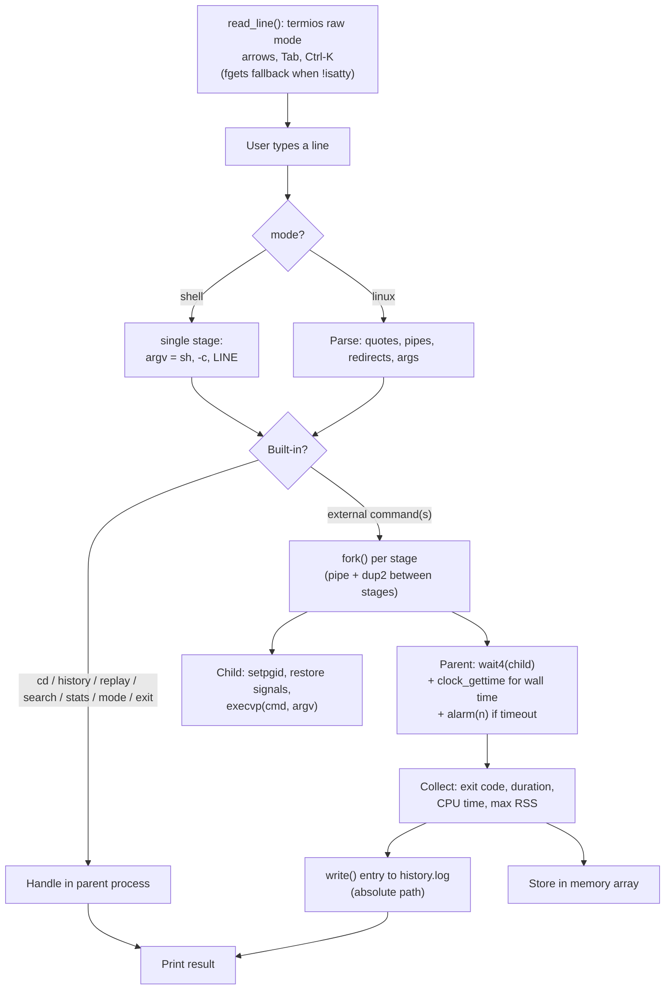
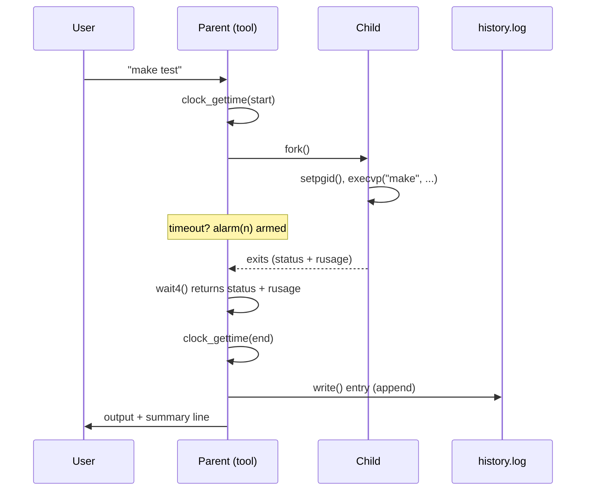

# 🛩️ Command History & Replay Tool
### *The "flight recorder" for your terminal commands*

**Mini Project — Operating Systems and System Calls** · Language: C (POSIX) · Platform: Linux / any POSIX OS

---

## 📑 Table of Contents

1. [Project at a Glance](#1-project-at-a-glance)
2. [Overview & Positioning](#2-overview--positioning)
3. [Problem Statement](#3-problem-statement)
4. [Scope & Feature Tiers](#4-scope--feature-tiers)
5. [Command Reference](#5-command-reference)
6. [Architecture](#6-architecture)
7. [System Calls Used](#7-system-calls-used)
8. [Design Notes](#8-design-notes)
9. [Log File Format](#9-log-file-format)
10. [Implementation Status](#10-implementation-status)
11. [Testing Plan](#11-testing-plan)
12. [Timeline](#12-timeline)
13. [Risks & Mitigations](#13-risks--mitigations)
14. [Deliverables](#14-deliverables)
15. [Demo Script](#15-demo-script)
16. [Build & Run](#16-build--run)
17. [Future Work](#17-future-work)

---

## 1. Project at a Glance

| | |
|---|---|
| **Core idea** | A command wrapper that runs commands for you and records *how they behaved*, not just *what you typed* |
| **Core pattern** | `fork()` → `execvp()` → `wait4()` |
| **Persistence** | Plain-text log file (`history.log`) |
| **Interface** | Interactive terminal REPL with a hand-rolled `termios` line editor (arrows, Tab completion) |
| **Execution** | Two switchable modes: `linux` (the tool calls `fork`/`execvp`/`pipe`/`dup2` itself) and `shell` (delegate to `sh -c`) |
| **Target user** | Developers who want to find slow, failing, or flaky commands |

> **One-line pitch:** *A terminal companion that remembers every command, measures its CPU and memory cost, and tells you which commands are slow, failing, or unreliable.*

---

## 2. Overview & Positioning

The tool is **not** a replacement for bash, cmd, or PowerShell. It sits on top of them as an *observer*: the user types commands into it, it runs them through POSIX system calls, and it records a detailed profile of each run.

Think of an aircraft's black box. It does not fly the plane — it records everything so you can analyze what happened afterward. This tool does the same for commands.

It answers questions an ordinary terminal cannot:

- Which command keeps getting slower over time?
- Which command fails intermittently (**flaky**)?
- How much CPU time and memory did that command really use?
- If I replay a command, did the result change compared to last time?

---

## 3. Problem Statement

| Limitation of a normal shell / `history` | What this tool adds |
|---|---|
| No exit code stored with history | ✅ Exit code recorded for every run |
| No execution time | ✅ Millisecond-precision wall-clock duration |
| No resource usage | ✅ CPU time (user/sys) and peak memory per command |
| Cannot compare reruns | ✅ `replay` shows differences vs. the previous run |
| Hung commands block you | ✅ `timeout` kills commands that exceed a limit |
| Transient failures need manual retries | ✅ `retry` reruns automatically |
| No usage statistics | ✅ `stats` for slow, frequent, failing, and flaky commands |

---

## 4. Scope & Feature Tiers

### 🟦 Tier A — Foundation (makes it a usable tool)

- [x] Run external commands (`fork` / `execvp` / `wait4`)
- [x] `cd` as a built-in using `chdir()` (cannot work in a child process)
- [x] Pipes `cmd1 | cmd2` using `pipe()` + `dup2()`
- [x] Redirection `>`, `>>`, `<` using `open()` + `dup2()`
- [x] **Ctrl+C kills only the running command**, not the tool (`sigaction`, `setpgid`)
- [x] Persistent history log (survives restarts)

### 🟩 Tier B — Differentiators (the demo highlights)

- [x] **Resource report** per command: CPU time and peak memory via `wait4()`
- [x] **`replay <id>`** with a diff against the previous run (exit code, duration change)
- [x] **`timeout <sec> <cmd>`** using `alarm()` / `SIGALRM` / `kill()`
- [x] **`retry <n> <cmd>`** reruns on failure
- [x] **Flaky detector**: flags commands that have both succeeded and failed in history

### 🟨 Tier C — Stretch goals

- [x] `history --failed`, `history --slow`
- [x] `!!` (rerun last command)
- [x] Export statistics to CSV
- [ ] Session separation in the log — *dropped, see below*

### 🟪 Tier D — Added during implementation

These were originally listed as out of scope. They were brought in because the raw-terminal mode
needed for Ctrl+C isolation already gives you character-at-a-time input for free, so a line editor
costs almost nothing extra — and because the two execution modes turned out to be the clearest way
to show what the tool itself does versus what a shell does.

- [x] **Line editor on `termios` raw mode**: Up/Down history recall, Left/Right cursor movement,
      Home/End, Backspace/Delete, Ctrl-A/E/K/L, Ctrl-C cancels the line, Ctrl-D exits
- [x] **Tab completion**, hand-rolled (no GNU readline): `PATH` scan with `access(X_OK)` for the
      first word, `opendir`/`readdir` filenames otherwise, longest-common-prefix insertion
- [x] **`mode linux` / `mode shell` toggle** — see §8

> **Why not GNU readline.** Linking readline would hide the terminal control behind a library and
> remove `tcgetattr` / `tcsetattr` / `select` from the system-call table this project is graded on.
> Hand-rolling it keeps every layer visible.

> **Why session separation was dropped.** The log format in §9 is deliberately minimal and stable.
> A session column would widen every line for a feature nothing else in the tool reads.

### 🚫 Out of scope

- Shell scripting, variables, `if`/`for`, `&&`/`||`, `;` chaining
- Globbing and `$VAR` expansion **in linux mode** — `mode shell` delegates the line to `sh -c`,
  which does expand them
- Multi-line commands

> Stating what is *out of scope* is a deliberate design decision — worth including in the final report.

---

## 5. Command Reference

| Command | Description |
|---|---|
| `<any command>` | Run it, then record it |
| `cmd1 \| cmd2` | Pipeline (Tier A) |
| `cmd > file`, `cmd >> file`, `cmd < file` | Redirection (Tier A) |
| `cd <dir>` | Change directory (built-in) |
| `pwd` | Print the working directory |
| `!!` | Rerun the previous command (Tier C) |
| `history` | Show all recorded commands |
| `history --failed` / `--slow` | Filtered views (Tier C) |
| `replay <id>` | Rerun a command and compare with its previous run |
| `retry <n> <cmd>` | Run up to *n* times until it succeeds |
| `timeout <sec> <cmd>` | Kill the command if it runs too long |
| `search <keyword>` | Find commands containing a keyword |
| `stats` | Usage and performance summary |
| `export <file.csv>` | Write the whole history as CSV (Tier C) |
| `mode [linux\|shell]` | Show or switch execution mode (Tier D) |
| `help` | Command list |
| `exit` | Quit |

Every built-in is reachable with **no argument**: a bare `replay` prints its usage instead of
falling through to `execvp()` and reporting "replay: command not found".

### Line-editing keys (Tier D)

| Key | Action |
|---|---|
| `↑` / `↓` | Recall previous and next commands |
| `←` / `→` | Move the cursor inside the line |
| `Home` / `End` | Jump to line start or end (also `Ctrl-A` / `Ctrl-E`) |
| `Tab` | Complete a command name (first word) or a filename (later words) |
| `Backspace` / `Delete` | Erase behind or ahead of the cursor |
| `Ctrl-K` | Delete to end of line |
| `Ctrl-L` | Clear the screen and redraw |
| `Ctrl-C` | At the prompt: abandon the line. During a command: kill it |
| `Ctrl-D` | Exit on an empty line |

### Example `stats` output

Actual output from a test session:

```
=== Command Statistics ===
Total commands   : 15
Distinct commands: 5
Most used        : "echo" (6 times)
Slowest          : "sleep 10" (2001 ms)
Highest memory   : "sleep 10" (7816 KB)
Failure rate     : 40% (6/15)

Flaky commands (both passed and failed):
  ! "sh" (passed 2, failed 1)
```

---

## 6. Architecture



Shell mode joins the same executor as a one-stage pipeline, so everything below the mode branch is
shared code.

### Lifecycle of one command



---

## 7. System Calls Used

| System call | Header | Purpose in this project |
|---|---|---|
| `fork()` | `<unistd.h>` | Create one child per command, or per pipeline stage |
| `execvp()` | `<unistd.h>` | Replace the child with the requested program |
| `wait4()` | `<sys/wait.h>`, `<sys/resource.h>` | Wait for a child **and** collect its `struct rusage` in one call |
| `pipe()` | `<unistd.h>` | Connect stages of a pipeline |
| `dup2()` | `<unistd.h>` | Redirect stdin/stdout to pipes or files |
| `open()` / `read()` / `write()` / `close()` | `<fcntl.h>`, `<unistd.h>` | Low-level file I/O for the log and redirections; byte reads in the line editor |
| `chdir()` / `getcwd()` | `<unistd.h>` | Implement the `cd` and `pwd` built-ins; render the prompt |
| `sigaction()` | `<signal.h>` | Install the parent's `SIGINT` and `SIGALRM` handlers reliably |
| `signal()` | `<signal.h>` | Reset `SIGINT`/`SIGALRM`/`SIGQUIT`/`SIGTERM` to `SIG_DFL` in each child before `execvp` |
| `kill()` | `<signal.h>` | Signal the whole process group: Ctrl+C forwarding and timeout |
| `alarm()` | `<unistd.h>` | Arm the timeout timer |
| `setpgid()` | `<unistd.h>` | Put each pipeline in its own process group so Ctrl+C and `timeout` target it |
| `_exit()` | `<unistd.h>` | Leave a failed child without flushing the parent's stdio buffers |
| `clock_gettime()` | `<time.h>` | Precise wall-clock timing (`CLOCK_MONOTONIC`) |
| `time()` | `<time.h>` | Log timestamps |
| `tcgetattr()` / `tcsetattr()` | `<termios.h>` | Switch the terminal to raw mode for the line editor, and restore it |
| `select()` | `<sys/select.h>` | Timed read that distinguishes a bare `Escape` press from an arrow-key sequence |
| `isatty()` | `<unistd.h>` | Fall back to `fgets()` when stdin is a pipe, so the tool stays scriptable |
| `opendir()` / `readdir()` / `closedir()` | `<dirent.h>` | Enumerate filenames for Tab completion |
| `access()` | `<unistd.h>` | Executable check while scanning `PATH` for command completion |
| `stat()` | `<sys/stat.h>` | Detect directories during completion and append a trailing `/` |
| `getenv()` | `<stdlib.h>` | Read `HOME` (prompt `~` and bare `cd`) and `PATH` (completion) |

**Not used, and why.** `waitpid()` and `getrusage()` are both superseded by `wait4()`, which
returns the status *and* the resource usage of that specific child in one call — `getrusage()` on
`RUSAGE_CHILDREN` reports cumulative totals for all reaped children, which cannot be attributed to
a single command. `execlp()` is unnecessary because argv is already built as a vector. `ioctl()`
turned out not to be needed: the editor redraws with ANSI escapes rather than querying the window
size, and `TIOCGWINSZ` would only matter for wrapping long lines.

---

## 8. Design Notes

**Why `cd` must be a built-in.** `cd` changes the working directory of the *calling process*. If it ran in a forked child, the directory would change in the child and vanish when it exits. The parent must call `chdir()` itself.

**Pipelines.** For `a | b`, create a pipe, fork twice, and in each child use `dup2()` to attach the pipe end to stdout (left side) or stdin (right side). Close unused pipe ends in every process or the reader will never see EOF.

**Ctrl+C handling.** The tool installs a `SIGINT` handler so it survives Ctrl+C. Each command is placed in its own process group (`setpgid`) and the signal is forwarded to that group, so only the running command dies.

**Timeout.** Before waiting, the parent calls `alarm(n)`. If `SIGALRM` fires while the child is still running, the handler calls `kill(-pgid, SIGKILL)` and the run is logged as timed out.

**Replay diff.** Each log entry is stored with its command text. On `replay <id>`, the tool finds the most recent previous run of the same command and prints the change in exit code and duration.

**Flaky detection.** A command is flagged *flaky* if its history contains both exit code `0` and non-zero results.

**Two execution modes.** `mode linux` (the default) makes the tool parse the line itself and call
`fork` / `execvp` / `pipe` / `dup2` directly — this is the mode that demonstrates the system calls.
`mode shell` hands the line to `sh -c`, so globs and `$VARS` expand:

```
[linux] ~/proj> echo *.c
*.c                              <- literal; the tool does not glob
[linux] ~/proj> mode shell
[shell] ~/proj> echo *.c
command_history_tool.c           <- sh expanded it
```

Shell mode is implemented as a **degenerate one-stage pipeline** whose argv is `sh -c <line>`, so
timing, `wait4` resource collection, signal forwarding, timeout and logging share exactly one code
path with linux mode. Only the argv differs. This keeps the two modes from drifting apart.

**Line editor.** `tcsetattr()` puts the terminal into raw mode (`ICANON`, `ECHO` and `ISIG` off) so
the tool sees every byte and draws the line itself. Raw mode is disabled before a command runs, so
the child inherits a normal canonical terminal. Arrow keys arrive as `ESC [ A/B/C/D`; because a bare
`Escape` press sends the same first byte, the follow-up bytes are read through `select()` with a
50 ms timeout rather than blocking forever.

**Scriptability.** When stdin is not a terminal, `isatty()` sends the tool down a plain `fgets()`
path. That is what makes `make test` and piped demos work, and it is why the interactive key
bindings cannot be tested non-interactively.

**Absolute log path.** The log file is resolved to an absolute path once at startup, before any
command can run. A relative `history.log` would start appending to a different file in every
directory the user `cd`s into, silently scattering and effectively losing history.

---

## 9. Log File Format

Plain text, one entry per line, `|`-separated, with the command **last** (so it may itself contain `|`):

```
id|timestamp|wall_ms|exit_code|user_ms|sys_ms|max_rss_kb|command
1|1791429312|4.94|0|0.00|3.78|7236|echo hello
2|1791429312|121.62|127|0.00|12.04|996|foobar123
3|1791429313|8.33|0|7.83|2.52|8016|ls | wc -l
```

| Field | Source |
|---|---|
| `timestamp` | `time(NULL)` |
| `wall_ms` | `clock_gettime(CLOCK_MONOTONIC)` delta |
| `exit_code` | `WEXITSTATUS(status)`; `124` for timeout, `127` for exec failure, `130` for Ctrl+C |
| `user_ms`, `sys_ms`, `max_rss_kb` | `struct rusage` from `wait4()` |
| `command` | Raw command line |

**A piped command makes its line have 9 fields, not 8** — `ls | wc -l` contains a literal `|`. That
is exactly why the command is stored last: the parser splits on the first seven separators and
treats the remainder as verbatim text, so pipelines survive a save/load round-trip intact.

For a pipeline the recorded `exit_code` is the **last** stage's status (shell convention), the CPU
times are **summed** across stages, and `max_rss_kb` is the **maximum**.

Plain text keeps the log easy to debug with `cat` / `grep` and avoids a serialization library.

---

## 10. Implementation Status

| Item | Status |
|---|---|
| Basic loop: `fork` / `execvp` / `wait4` | ✅ Done |
| Log persistence (`open` / `write` / `read`), absolute-anchored path | ✅ Done |
| `history`, `replay`, `search`, `stats` | ✅ Done |
| Tier A: `cd`, pipes, redirects, Ctrl+C handling | ✅ Done |
| Tier B: resource report, replay diff, timeout, retry, flaky | ✅ Done |
| Tier C: filters, `!!`, CSV export | ✅ Done (session separation dropped — see §4) |
| Tier D: `termios` line editor, Tab completion, mode toggle | ✅ Done |

All of §11 was executed on WSL Ubuntu against a build with **zero warnings** under
`-Wall -Wextra -std=c99`. The interactive key bindings were verified over a real pty, since they
are unreachable through piped input by design.

---

## 11. Testing Plan

All cases executed on WSL Ubuntu against a build with zero warnings under `-Wall -Wextra`.

| Test case | Expected result | Result |
|---|---|---|
| `echo hello` | Output shown, exit `0` logged | ✅ |
| `foobar123` (nonexistent) | "command not found", exit `127` logged | ✅ |
| `cd /tmp` then `pwd` | Working directory actually changed | ✅ prompt followed to `/tmp` |
| `ls \| wc -l` | Correct count, no hang | ✅ stored intact with its `\|` |
| `echo hi > out.txt` then `cat out.txt` | File contains `hi` | ✅ |
| `sleep 10` then Ctrl+C | `sleep` dies; the tool keeps running | ✅ logged as exit `130` |
| Ctrl+C during a pipeline | Every stage dies | ✅ |
| `timeout 2 sleep 10` | Killed after ~2 s, logged as timeout | ✅ `wall=2001ms`, exit `124` |
| `timeout` on a process group | Background children die too | ✅ no survivors |
| `retry 3 false` | Runs 3 times, then reports failure | ✅ |
| `replay` valid / invalid id | Reruns with diff / graceful error | ✅ |
| Restart the tool | Previous history reloaded | ✅ |
| Empty input | Prompt reappears, nothing logged | ✅ |
| Log stays in one file after `cd` | No stray `history.log` in visited directories | ✅ absolute path anchored at startup |
| `!!` | Expands to and reruns the previous command | ✅ |
| Flaky detection | Alternating-exit command flagged | ✅ with passed/failed counts |
| `mode shell` vs `mode linux` | Globs and `$VARS` expand only in shell mode | ✅ |
| `export` | Valid CSV | ✅ every row 9 fields per Python `csv` |
| Bare `replay` / `search` / `retry` / `timeout` | Usage message, not "command not found" | ✅ |
| `↑ ↓ ← → Home End Delete` | Line edits correctly | ✅ verified over a real pty |
| `Ctrl-A/E/K/L/C/D` | Edit, cancel, clear, exit | ✅ verified over a real pty |
| `Tab` | Completes commands and filenames | ✅ `ech⇥`→`echo`, `cat Make⇥`→`cat Makefile` |

> The interactive rows **cannot** be tested through piped input: `isatty()` deliberately switches
> the tool to a plain `fgets()` path so that scripts and `make test` work. They were verified by
> driving the tool through a pseudo-terminal instead.

### Bugs found and fixed during testing

| Bug | Fix |
|---|---|
| Relative `history.log` scattered entries into every directory the user visited | Resolve to an absolute path once at startup, before any `cd` |
| `replay` crashed the comparison because `hist_record()` can `realloc()` the array the old entry lives in | Snapshot the entry into a local copy before running |
| Tab completion inserted NUL bytes (`ech⇥` produced `ech\0`, `cat Make⇥` produced `Make\0\0\0\0`) | Copy the extra characters from the candidate, not from past the end of the typed prefix |
| Bare `replay` / `search` / `retry` / `timeout` were `execvp`'d as programs | Match built-ins at a word boundary and let each print its own usage |
| `history` CPU column printed `3/3     ms`, breaking header alignment | Pre-render the pair into one padded field |
| A fork failure mid-pipeline leaked already-created pipe descriptors | Capture the pipe and child counts before the fork loop |
| Ambiguous Tab flooded the terminal (WSL inherits all of System32 in `PATH`) | Cap the printed candidate list and report how many were omitted |
| Child output and parent summaries interleaved out of order when stdout was a pipe | Line-buffer stdout with `setvbuf` |

---

## 12. Timeline

| Week | Milestone |
|---|---|
| 1 | Finalize scope, repo setup, basic run loop |
| 2 | Logging + history loading |
| 3 | Tier A: `cd`, pipes, redirects, signal handling |
| 4 | Tier B: resource report, timeout, retry |
| 5 | Replay diff, flaky detection, `stats` |
| 6 | Testing, documentation, report |
| 15 | Demo presentation |

*(Adjust to your actual course calendar.)*

---

## 13. Risks & Mitigations

| Risk | Mitigation |
|---|---|
| Quoted arguments (`echo "a b"`) are hard to parse | Implement simple quote handling; document the limitation |
| Pipe ends left open cause hangs | Close all unused fds in every process; test with `ls \| wc` |
| Zombie processes | Every `fork()` paired with `wait4()`; use `_exit()` in failed children |
| Signal races (Ctrl+C / timeout) | Use `sigaction`, keep handlers minimal (set flag / call `kill` only) |
| Log grows without bound | Cap in-memory entries; optional log rotation |
| Scope creep | Finish Tier A fully before starting Tier B |

---

## 14. Deliverables

| Deliverable | Contents |
|---|---|
| **Source code + documentation** | Commented `.c` source, README with build/run steps |
| **Demo presentation (Week 15)** | Live demo following the script below |
| **Final report** | Architecture diagrams (§6), system call table (§7), feature list (§4), test results (§11) |

---

## 15. Demo Script

1. Run a few normal commands (`ls`, `echo`) → show the per-command summary line
2. Run a pipeline and a redirect → show Tier A works like a real shell
3. `foobar123` → "command not found", exit `127` recorded
4. `sleep 30` → press Ctrl+C → the command dies, the tool survives, exit `130` recorded
5. `timeout 2 sleep 30` → killed automatically, exit `124`
6. `timeout 2 sh -c "sleep 30 & sleep 30 & wait"` → the **whole process group** dies
7. Run a heavy command (e.g. compile) → show CPU time and peak RSS in the log
8. `replay` a command → show the diff against the previous run
9. `retry 3 false` → three attempts, then a failure report
10. `stats` → show slowest, most-used, failure rate, flaky warnings
11. `mode shell` → `echo *.c` expands; `mode linux` → it does not
12. Arrow keys, `Home`/`End`, `Tab`, `Ctrl-K`, `Ctrl-L` → the line editor
13. `export report.csv` → open it in a spreadsheet
14. Exit and restart → history is still there

---

## 16. Build & Run

Requires a POSIX environment (Linux, macOS, BSD, or WSL on Windows). **It will not build on native
Windows / MinGW** — `fork`, `wait4`, `setpgid` and `termios` do not exist there.

From Windows PowerShell, cross into WSL first; `make` is not installed on the Windows side, so
pasting the build command into PowerShell fails with *"The term 'make' is not recognized"*:

```powershell
wsl -d Ubuntu
cd /mnt/d/Code/OS_Tet/proj
make
./history_tool
```

Always pass `-d Ubuntu`: the default WSL distro may be `docker-desktop`, which has no usable shell.

Or without make:

```bash
gcc -O2 -Wall -Wextra -std=c99 command_history_tool.c -o history_tool
./history_tool
```

| Make target | Effect |
|---|---|
| `make` | Compile to `./history_tool` |
| `make run` | Compile and start the tool |
| `make test` | Non-interactive smoke test (cannot reach the line editor — see §11) |
| `make clean` | Remove the binary, `history.log`, `history.csv`, `out.txt` |

> **Windows note:** keep the `Makefile` with LF line endings. A CRLF `Makefile` fails with
> `*** missing separator`, and Make parses recipes line by line, so a shell heredoc inside a recipe
> is read as a bogus rule. Use `printf '...\n...' | ./$(TARGET)` instead.

---

## 17. Future Work

- Replay a range (`replay 3-7`)
- Tag commands (`#deploy`) for filtering
- Per-session log files
- Warn when a command is much slower than its historical average
- Capture and hash output to detect *output* changes between reruns
